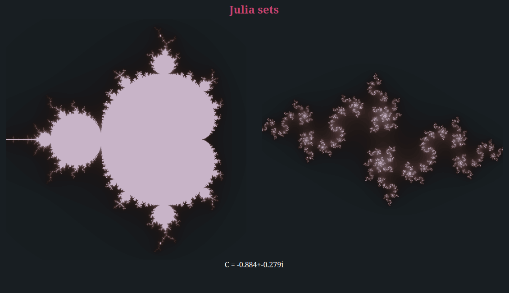

# Julia sets

This repository is a project demonstrating what you can do with wasm-bindgen to make a fast dynamic webpage using webassembly.

The result is hosted here: https://rambip.github.io/web-julia

> inspired by [this page](https://rustwasm.github.io/wasm-bindgen/examples/julia.html)

# Building

Build the project with **nix**.
(Install nix, and do `nix-build` inside the repo)

This will create a folder "result", with all the static files for the site.

