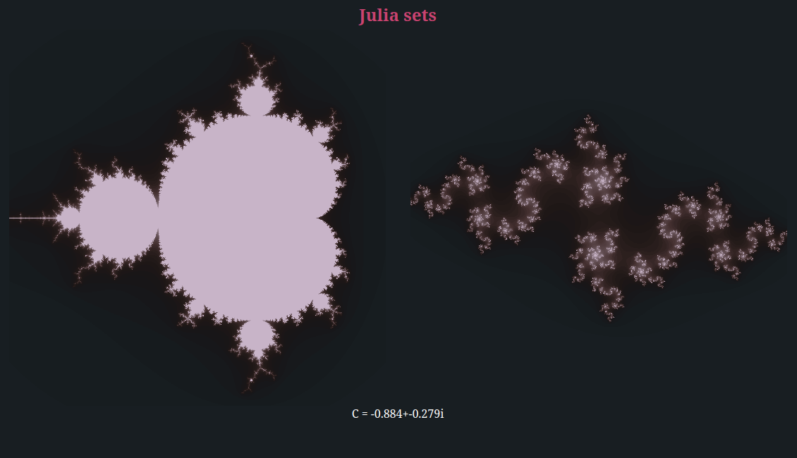

# Julia sets

This repository is a project demonstrating what you can do with wasm-bindgen to make a fast dynamic webpage using webassembly.

You can build it with `build.sh`. The site will run locally, just type 'http://localhost:8000/' in your browser to test it.

- Prerequisites:
- - The [wasm-pack](https://github.com/rustwasm/wasm-pack) toolchain to compile the rust file to webassembly
- - Python 3 with the `http.server` module. Try `pip install http.server` if you don't have it.

> inspired by [this page](https://rustwasm.github.io/wasm-bindgen/examples/julia.html)
